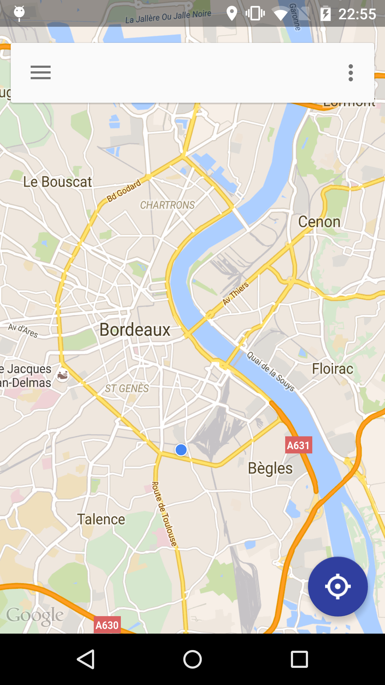
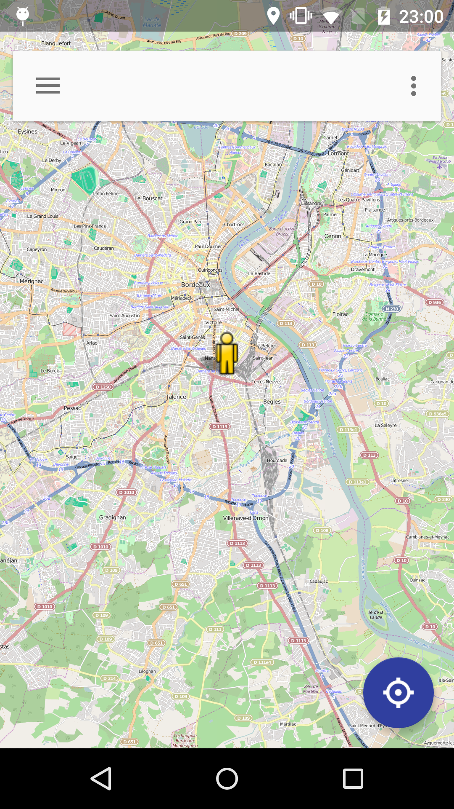
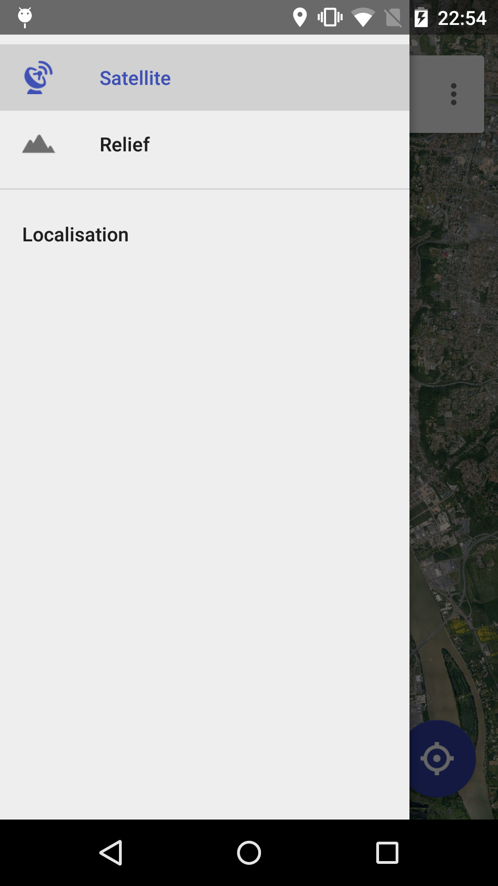

# BasicLocationApp
A basic application that lets you interact with the Google location provider. It is heavily inspired from the Google Maps application and its Material Design. It attempts to demonstrate how to develop this app main features.

# Preview





# Features
This basic location application implements these several following features :
* Fetch user position
* Display the user's position in either
  * Google Map
  * Open Street Map
* Reset map to user's location
* Navigation drawer with three items
  * Enable/disable satellite mode (only supported for Google Map)
  * Enable/disable terrain mode (only supported for Google Map)
  * Display a location information view which gathers the user's latitude/longitude/accuracy/city
* Support portrait/landscape mode
* Support tablet with custom layouts
* Handle Android M new permission system
* Detect GPS loss/recovery

# Technical considerations
This project uses [Gradle](http://tools.android.com/tech-docs/new-build-system/user-guide) as a dependencies management tool. I also uses [AndroidAnnotations](https://github.com/excilys/androidannotations) that lets you speed up your Android development.

The location is fetched by the **GoogleApiClient** from the Google Play Services. On top of it a **KBLocationProvider** has been created to let you track your locations updates or stop it when you no longer need it. For instance, you may need to fetch your location and stop the location servive as soon as you found an acceptable accuracy. Furthermore, the provider can trigger a timer that will stop fetching the location as soon as the timeout duration is reached and that no location with an acceptable accuracy has been found. Finally, the provider uses the **LocationManager** in order to listen to GPS updates and let the user know whether the GPS has been found/lost.

Google Maps was displayed using a debug API key generated from my **debug.keystore** fil and after creating an Google application from the [Google Developer Console](https://console.developers.google.com/project/). The Open street Map does not need any API key but requires to include **osmdroid** and **slf4j** dependencies.

The User Interface uses the new Material Design guidelines and includes the [Android design library](http://android-developers.blogspot.fr/2015/05/android-design-support-library.html).

Finally the application is API 14 minimum and supports the lattest Marshmallow API 23.

# Testing
The application has been configured to use [Robolectric](http://robolectric.org/getting-started/) test library and should be up and running. There are still several issues with the lattest version 3.0 configured with Android M and AndroidAnnotations.

There are still tests to be written to cover the application

# Enhancements
Here is a list of a few features that could be added to this application:

* Add zoom-in and zoom-out float buttons to have a better control of the zoom that has been arbitrarily set. It would be especially useful for the Open Street Map as there is no pan gesture embedded to control the zoom level
* Add a settings activity to define your preferences:
  * Zoom level on launch
  * Default map to display on launch
* Let user add markers and annotate it with the address
* Support more maps
* Add place provider that would list the locations of the searched items (e.g: pharmacy)
* Better handling of GPS loss/recovery with different status to let know the user for how long the GPS was lost
* Add unit tests with **Robolectric** and/or **Mockito**
* Add integration tests **Roboguice**
* Add UI tests with **Espresso**

# License

```
Copyright 2015 Stephen Vinouze.

Licensed under the Apache License, Version 2.0 (the "License");
you may not use this file except in compliance with the License.
You may obtain a copy of the License at

   http://www.apache.org/licenses/LICENSE-2.0

Unless required by applicable law or agreed to in writing, software
distributed under the License is distributed on an "AS IS" BASIS,
WITHOUT WARRANTIES OR CONDITIONS OF ANY KIND, either express or implied.
See the License for the specific language governing permissions and
limitations under the License.
```
