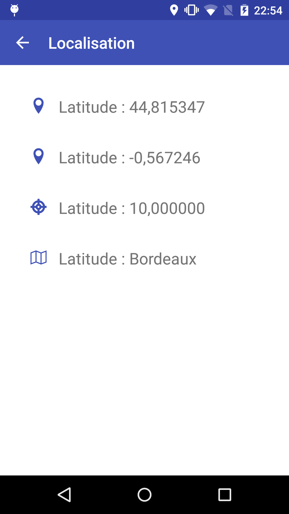
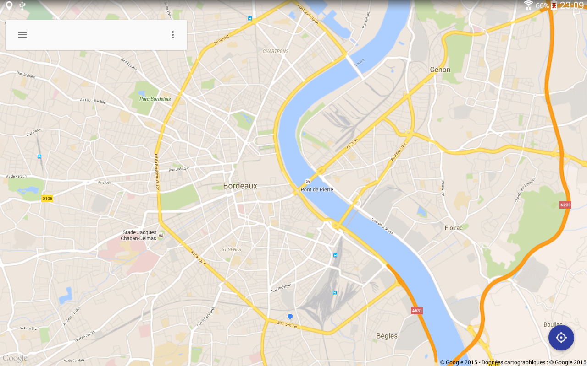
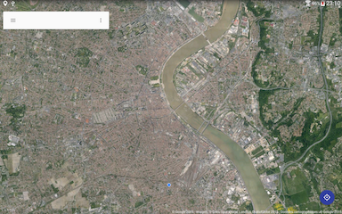
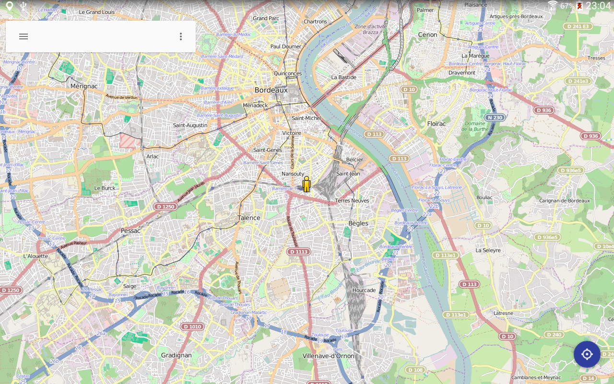
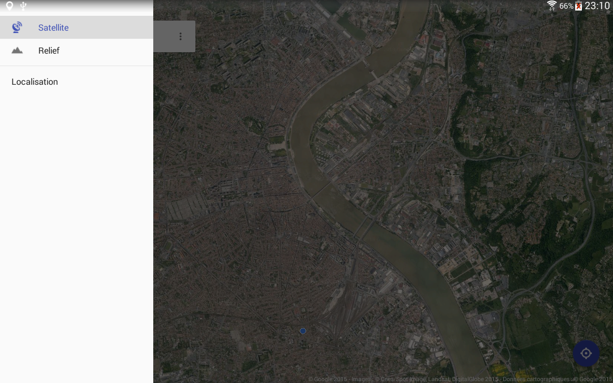
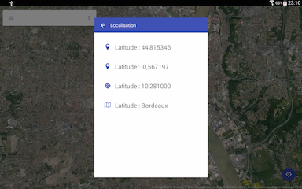

# BasicLocationApp
A basic application that lets you interact with the Google location provider. It is heavily inspired from the Google Maps application and its Material Design. It attempts to demonstrate how to develop this app main features.

# Features
This basic location application implements these several following features :
* Fetch user position
* Display the user's position in either
  * Google Map
  * Open Street Map
* Reset map to user's location
* Navigation drawer with three items
  * Enable/disable satellite mode (only supported for Google Map)
  * Enable/disable terrain mode (only supported for Google Map)
  * Display a location information view which gathers the user's latitude/longitude/accuracy/city
* Support portrait/landscape mode
* Support tablet with custom layouts
* Handle Android M new permission system
* Detect GPS loss/recovery

# Preview









## License

```
Copyright 2015 Stephen Vinouze.

Licensed under the Apache License, Version 2.0 (the "License");
you may not use this file except in compliance with the License.
You may obtain a copy of the License at

   http://www.apache.org/licenses/LICENSE-2.0

Unless required by applicable law or agreed to in writing, software
distributed under the License is distributed on an "AS IS" BASIS,
WITHOUT WARRANTIES OR CONDITIONS OF ANY KIND, either express or implied.
See the License for the specific language governing permissions and
limitations under the License.
```
